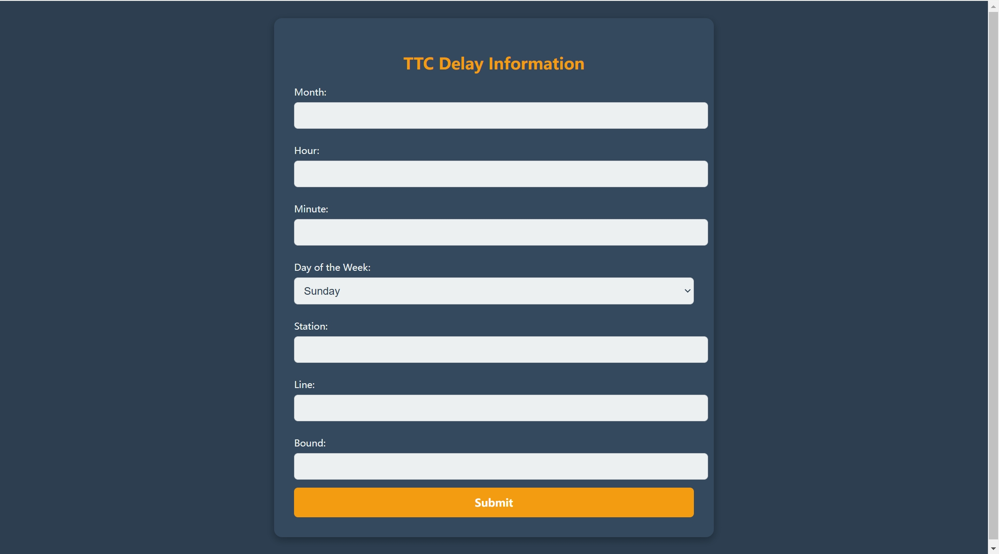
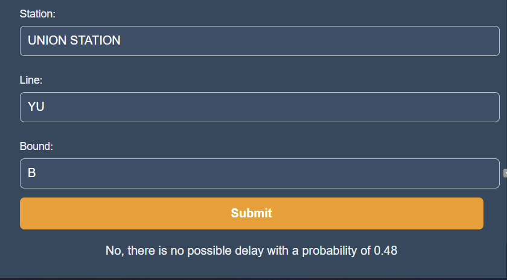

# TTC Transit Delay Prediction

## Description

The Toronto Transit Commission (TTC) serves as a lifeline for millions of daily commuters across the city's subway, streetcar, and bus networks. However, recurring delays across various routes pose significant challenges to its reliability, which undermines public confidence and complicates efforts to promote sustainable transportation. This project addresses these issues by analyzing TTC subway delay data, building a predictive machine learning model, and providing an easy-to-use web application for real-time predictions.

The project consists of three parts:
1. **Exploratory Data Analysis (EDA)**: Visualizing key trends in TTC subway delays to identify patterns and gain business insights.
2. **Machine Learning Model**: Using a Random Forest algorithm to predict delays based on factors like starting point, destination, and departure time.
3. **Web Application**: A user-friendly interface that integrates the machine learning model, allowing users to input travel information and receive delay predictions.

## Table of Contents

1. [Authors/Contributors](#authorscontributors)
2. [Motivation](#motivation)
3. [Problem Statement](#problem-statement)
4. [Features](#features)
5. [Technical Implementation](#technical-implementation)
6. [Setup and Installation](#setup-and-installation)
7. [Usage Guide](#usage-guide)
8. [ML Model](#ml-model)
9. [License](#license)
10. [Feedback and Contributions](#feedback-and-contributions)
11. [Credits and Acknowledgements](#credits-and-acknowledgements)

## Authors/Contributors
### 02201 Team Transit Titans
- Zhe Wang
- Virat Talan
- Daivi Shah
- Euichan Kim

## Motivation

Public transit delays can undermine the effectiveness of urban transportation systems, leading to frustration and decreased usage. By forecasting delays, commuters can make more informed decisions, and the TTC can improve service reliability. This project aims to provide actionable insights that contribute to enhancing the TTC’s operational efficiency and promoting sustainable transportation alternatives.

## Problem Statement

TTC’s subway network faces persistent delays that affect commuters' daily routines. Addressing these delays through predictive analytics can improve the transit experience and support the city's long-term goals of reducing carbon emissions. This project aims to develop a model that predicts delays based on a variety of factors, improving both operational efficiency and commuter satisfaction.

## Features

- **Interactive Web Application**: Allows users to input travel details (e.g., starting point, destination, departure time) and receive a delay prediction.
- **Real-Time Predictions**: Get estimated delays and probabilities of delays based on historical data.
- **Comprehensive EDA**: Visualizations showcasing key trends and patterns in subway delays.
- **Machine Learning Model**: A Random Forest model for delay prediction with an accuracy of 73%.

## Technical Implementation

### Technologies Used:
- **Frontend**: HTML, CSS, JavaScript, React, Tailwind CSS
- **Backend**: Flask
- **Machine Learning**: Random Forest, Scikit-learn, Pandas
- **Database**: SQLite (for storing delay data)
- **Deployment**: Vercel for the web application, GitHub for version control

### Key Libraries:
- **Pandas**: Data manipulation and analysis.
- **Scikit-learn**: Machine learning library for building and training the model. 
- **NumPy**: Library for numerical computations.
- **Plotly**: Interactive graphing library for creating visualizations. 
- **Matplotlib**: Plotting library for static, animated, and interactive visualizations. 


## Setup and Installation

1. Clone the repository:

    ```bash
    git clone https://github.com/your-username/ttc-delay-prediction.git
    cd ttc-delay-prediction
    ```

2. Install required dependencies:

    ```bash
    pip install -r requirements.txt
    ```

3. Run the backend server:

    ```bash
    python app.py
    ```

4. Access the web app in your browser at `http://127.0.0.1:5000`.

## Usage Guide

### Step 1:
Navigate to the website: [https://datathon-pearl.vercel.app/](https://datathon-pearl.vercel.app/)


### Step 2:
Enter your travel details (starting point, destination, and departure time) in the specified format (ALL CAPITAL).

### Step 3:
Click on **Submit** to view the predicted delay and probability.


## ML Model

### Model Overview:
We trained a **Random Forest** model using the scikit-learn library. The model predicts whether a delay is expected, based on input parameters like starting point, destination, and departure time.

### Performance:
- The model was evaluated using a validation set of 4800 samples, achieving an accuracy of 73%.

## License

This project is licensed under the MIT License. See the [LICENSE](LICENSE) file for more details.

## Feedback and Contributions

This project was part of a SDSS **datathon** competition and is no longer accepting contributions. However, feedback is welcome! If you encounter any issues or have suggestions, feel free to open an issue on GitHub. 

## Credits and Acknowledgement
- Special thanks to **SDSS** and **Toronto Transit Commission (TTC)** for providing the data used in this project.

